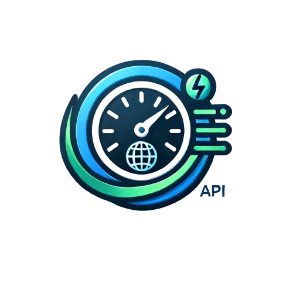

<p>  </p>
<h1 align="center"> <b> PageSpeed API </b></h1>

## Overview

The PageSpeed API is a NestJS-based service that periodically checks the performance, accessibility, best practices, and
SEO of a given URL using Google's PageSpeed Insights API. The results are compiled into a detailed PDF report with
charts and audit details.

## Features

- Periodically fetches PageSpeed data for a specified URL.
- Generates a comprehensive PDF report with performance metrics and audit details.
- Allows setting the URL and interval for checks via API endpoints.
- Visualizes data using Chart.js.

## Installation

1. Clone the repository:

   ```bash
   git clone https://github.com/yourusername/pagespeed-api.git
    ```
2. Install the dependencies:

````bash
cd pagespeed-api
npm install
````

3. Configure environment variables (if needed):

```bash
cp .env.example .env
```

4. Run the application:

```bash
npm run start
```
## API Endpoints
### Set URL
Sets the URL for PageSpeed checks.
- **Endpoint:** /api/url
- **Method:** POST
- Query Parameters:
  - `url` (string): The URL to check.
  - `interval` (number): The interval in minutes between checks.
- Example:
  ```bash
  curl -X GET 'http://localhost:3000/pagespeed/set-url?url=https://example.com'
  ```

### Set Interval
Sets the interval for PageSpeed checks.
- **Endpoint:** `/pagespeed/set-interval`
- Method: `GET`
- Query Parameters:
    - `interval` (number): The interval in minutes between checks.
- Example:
    ```bash
   curl -X GET 'http://localhost:3000/pagespeed/set-interval?interval=60'
    ```

## How It Works
1. `Initialization:`
    - The application starts by fetching the URL and interval from the environment variables.
    - It then schedules a job to run the PageSpeed check at the specified interval.
    - The job is implemented using NestJS's `Cron` module.
    - The job calls the `fetchPageSpeedData` method to fetch the PageSpeed data for the URL.
    - The data is then saved to the database using TypeORM.
    - The job is scheduled to run at the specified interval.
    - The application also exposes API endpoints to set the URL and interval for checks.
    - The API endpoints update the URL and interval in the environment variables and reschedule the job.
    - The application also exposes an endpoint to generate a PDF report of the PageSpeed data.
2. `Fetching Data:`
    - The `fetchPageSpeedData` method fetches the PageSpeed data using Google's PageSpeed Insights API.
    - The method sends a request to the API with the URL and API key.
    - The API returns a JSON response with performance metrics and audit details.
    - The method parses the response and saves the data to the database.
    - The data includes performance metrics like FCP, LCP, CLS, and audit details for performance, accessibility, best practices, and SEO.
3. `Generating PDF Report:`
    - The application exposes an endpoint to generate a PDF report of the PageSpeed data.
    - The endpoint fetches the PageSpeed data from the database.
    - The data is then passed to a PDF generation library like `pdfkit` to create a detailed report.
    - The report includes charts for performance metrics and audit details.
    - The report is saved to the filesystem and can be downloaded by the user.
    - The report can be scheduled to be generated periodically along with the PageSpeed checks.
    - The report can be customized with additional data or styling as needed.
    - The report can be shared with stakeholders to track the performance of the website over time.
4. `Visualizing Data:`
    - The application uses Chart.js to visualize the PageSpeed data.
    - The charts display performance metrics like FCP, LCP, CLS over time.
    - The charts can be customized with different colors, labels, and styles.
    - The charts provide a visual representation of the website's performance trends.
    - The charts can be embedded in the PDF report for easy reference.
    - The charts can be shared with stakeholders to highlight areas for improvement.
    - The charts can be used to track the impact of optimizations on performance metrics.
    - The charts can be updated in real-time as new PageSpeed data is fetched.
    - The charts can be exported as images or included in presentations.
5. `Saving PDF:`
    - The PDF report is saved to the filesystem for future reference.
    - The report can be accessed by users to review the PageSpeed data.
    - The report can be shared with stakeholders to communicate performance insights.
    - The report can be archived for historical tracking of website performance.
    - The report can be downloaded by users for offline viewing.
    - The report can be attached to emails or shared via messaging apps.
    - The report can be printed or included in presentations.
    - The report can be customized with branding or additional information.
## Project Structure
* `src/pagespeed/pagespeed.service.ts:` The main service that handles fetching PageSpeed data and generating PDF reports.
* `src/pagespeed/pagespeed.controller.ts:` The controller that exposes API endpoints to set the URL and interval for checks.
* `src/main.ts:` The entry point of the application.

## Dependencies
* `nestjs/common:` Essential NestJS decorators and utilities.
* `nestjs/config:` Configuration module for NestJS applications.
* `nestjs/cron:` Scheduling module for NestJS applications.
* `axios:` Promise-based HTTP client for Node.js.
* `pdfkit:` PDF generation library for Node.js.
* `chart.js:` Simple yet flexible JavaScript charting for designers & developers.
* `fs-extra:` File system utilities for creating directories and saving files.
* `path:` Node.js path module for handling file paths.
* `puppeteer:` Headless Chrome Node.js API for generating PDF reports.


